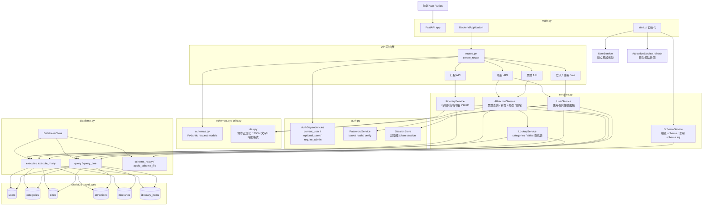

# 後端架構說明

本後端使用 FastAPI + MariaDB。Python 程式採用分層架構：`main.py` 負責組裝應用程式，`routes.py` 負責 API 路由，`services.py` 負責商業邏輯，`database.py` 負責資料庫存取。

## 目錄重點

| 檔案 | 角色 | 主要功能 |
|---|---|---|
| `main.py` | 應用程式入口 | 建立 FastAPI app、設定 CORS、註冊例外處理、掛載 API routes、執行 startup 初始化。 |
| `routes.py` | API 路由層 | 定義所有 HTTP endpoints，接收 request body/query/path 參數，呼叫 service，回傳統一 `{ "data": ... }` 格式。 |
| `services.py` | 服務層 | 放主要商業邏輯與資料庫操作流程，包含使用者、景點、行程、schema 檢查、查找表處理。 |
| `schemas.py` | Request models | 集中管理 Pydantic models，用於驗證前端傳入資料。 |
| `auth.py` | 認證與 session | 密碼雜湊/驗證、記憶體 session token、FastAPI dependency 認證邏輯。 |
| `database.py` | 資料庫工具層 | MariaDB 連線、查詢、寫入、schema 檢查、執行 schema 檔、資料型別轉換。 |
| `utils.py` | 共用工具 | 城市名稱正規化、從地址推城市、dict 轉 JSON 文字、時間格式處理。 |
| `schema.sql` | 資料庫結構 | 建立資料庫與資料表，目前包含 users、categories、cities、attractions、itineraries、itinerary_items。 |
| `data_setting.sql` | 景點資料匯入 | 將景點資料匯入 `categories`、`cities`、`attractions`，並重設相關表格資料。 |
| `attraction_dt.json` | 原始景點資料 | 景點來源資料。目前後端 Python 不會直接讀取此 JSON，匯入由 `data_setting.sql` 負責。 |

## 啟動流程

後端入口是 `main.py`：

```text
uvicorn main:app
```

啟動時流程：

1. `BackendApplication` 建立 FastAPI app。
2. 建立服務物件：
   - `SchemaService`
   - `SessionStore`
   - `PasswordService`
   - `AuthDependencies`
   - `LookupService`
   - `UserService`
   - `AttractionService`
   - `ItineraryService`
3. 設定 CORS。
4. 設定 HTTP exception handler，讓錯誤格式統一回傳 `{ "message": ... }`。
5. 透過 `create_router(...)` 掛載所有 API。
6. startup 時執行：
   - `SchemaService.ensure()`：檢查資料表結構，不符合時套用 `schema.sql`。
   - `UserService.seed_defaults()`：如果 users 是空的，建立預設測試帳號與管理員帳號。
   - `AttractionService.refresh()`：從資料庫讀取景點並建立記憶體快取。

## 分層責任

### `main.py`

`main.py` 不直接處理資料庫 CRUD，也不寫大量 API 邏輯。

主要類別：

| 類別 | 功能 |
|---|---|
| `BackendApplication` | 組裝整個後端 app。 |

主要責任：

- 建立 `FastAPI()`。
- 設定 CORS。
- 設定例外處理。
- 建立各個 service。
- 掛載 `routes.py` 建立的 router。
- 定義 startup 初始化流程。

### `routes.py`

`routes.py` 是 API 層，只負責 HTTP 介面。

主要函式：

| 函式 | 功能 |
|---|---|
| `create_router(...)` | 建立並回傳 FastAPI `APIRouter`。 |

路由分組：

| 類型 | Endpoints |
|---|---|
| 認證 | `POST /login`、`POST /register` |
| 個人帳號 | `GET /me`、`PATCH /me`、`PUT /me/password`、`DELETE /me` |
| 景點 | `GET /attractions`、`GET /attractions/{id}`、`POST /attractions`、`PUT /attractions/{id}`、`DELETE /attractions/{id}` |
| 行程 | `GET /itineraries`、`GET /itineraries/trash`、`GET /itineraries/current`、`POST /itineraries`、`PATCH /itineraries/{id}`、`DELETE /itineraries/{id}` |
| 行程項目 | `PUT /itineraries/{id}/items`、`POST /itineraries/{id}/items`、`PATCH /itineraries/{id}/items/{item_id}`、`DELETE /itineraries/{id}/items/{item_id}` |
| 後台使用者 | `GET /admin/users`、`DELETE /admin/users/{user_id}` |

路由層原則：

- 不直接寫複雜 SQL。
- 不直接處理密碼雜湊。
- 不直接維護景點快取。
- 只呼叫 service，並把結果包成 `{ "data": ... }`。

### `services.py`

`services.py` 是主要商業邏輯層。

#### `SchemaService`

負責檢查資料庫 schema 是否符合目前後端需求。

功能：

- 檢查必要資料表是否存在。
- 檢查 `users` 是否有 `role` 欄位。
- 檢查 `attractions` 欄位是否符合目前 3NF 版本。
- 檢查舊表是否已移除。
- 若 schema 不符合，執行 `schema.sql`。

#### `LookupService`

負責處理查找表：

- `categories`
- `cities`

功能：

- 根據分類名稱取得 `category_id`。
- 根據城市名稱取得 `city_id`。
- 若名稱不存在，會自動 `INSERT IGNORE` 建立資料。

#### `UserService`

負責使用者與帳號相關邏輯。

功能：

- 建立預設帳號。
- 登入。
- 註冊。
- 更新個人資料。
- 修改密碼。
- 刪除自己帳號。
- 後台列出使用者。
- 後台刪除一般使用者。

使用到：

- `PasswordService`：密碼 hash/verify。
- `SessionStore`：建立與移除 token session。

#### `AttractionService`

負責景點資料。

功能：

- 從資料庫載入景點並建立快取。
- 回傳景點列表。
- 根據關鍵字、城市、分類、排序、分頁篩選景點。
- 取得單一景點。
- 後台新增景點。
- 後台更新景點。
- 後台軟刪除景點。

快取資料：

```text
items      -> 景點列表
item_map   -> attraction_id 對應 items index
```

這樣 `GET /attractions/{id}` 可以快速取得景點。

#### `ItineraryService`

負責行程與行程項目。

功能：

- 查詢使用者一般行程。
- 查詢垃圾桶行程。
- 查詢目前行程。
- 建立行程。
- 更新行程標題、開始日期、天數。
- 軟刪除行程。
- 還原行程。
- 永久刪除行程。
- 新增行程項目。
- 整批覆蓋行程項目。
- 修改行程項目時間、備註、日期、排序。
- 刪除行程項目。

權限原則：

- 所有行程操作都會確認 `itinerary.user_id` 是否等於目前登入使用者。

### `schemas.py`

集中放 request body 的 Pydantic models。

| Model | 用途 |
|---|---|
| `LoginBody` | 登入。 |
| `RegisterBody` | 註冊。 |
| `UpdateProfileBody` | 修改姓名或 email。 |
| `ChangePasswordBody` | 修改密碼。 |
| `CreateItineraryBody` | 建立行程。 |
| `UpdateItineraryBody` | 更新行程。 |
| `ItineraryItemInput` | 行程項目基本資料。 |
| `PutItemsBody` | 整批覆蓋行程項目。 |
| `AddItemBody` | 新增單一行程項目。 |
| `UpdateItemBody` | 修改行程項目。 |
| `AttractionBody` | 後台新增/修改景點。 |

### `auth.py`

負責認證與 session。

#### `PasswordService`

功能：

- `hash(password)`：使用 bcrypt 產生密碼雜湊。
- `verify(password, hashed)`：驗證密碼。

#### `SessionStore`

目前使用記憶體保存 token。

功能：

- 建立 token。
- 透過 token 取得使用者。
- 更新 session 中的使用者資訊。
- 使用者刪除時移除相關 session。

注意：

```text
SessionStore 是記憶體型 session。
後端重啟後，所有登入 token 會失效。
```

#### `AuthDependencies`

提供 FastAPI dependency：

- `current_user`：必須登入。
- `optional_user`：可登入可不登入。
- `require_admin`：檢查目前使用者是否為 admin。

### `database.py`

負責 MariaDB 存取。

#### `DatabaseClient`

主要方法：

| 方法 | 功能 |
|---|---|
| `query(sql, params)` | 執行 SELECT，回傳多筆 dict。 |
| `query_one(sql, params)` | 執行 SELECT，回傳第一筆或 `None`。 |
| `execute(sql, params)` | 執行 INSERT/UPDATE/DELETE，回傳 lastrowid。 |
| `execute_many(sql, params_list)` | 批次執行相同 SQL。 |
| `schema_ready(required_tables)` | 檢查必要資料表是否存在。 |
| `apply_schema_file(path)` | 執行 `schema.sql`。 |

為了相容既有程式，檔案底部仍保留：

```python
query(...)
query_one(...)
execute(...)
execute_many(...)
schema_ready(...)
apply_schema_file(...)
```

這些函式會委派給 `default_client`。

### `utils.py`

共用工具。

| 函式 / 常數 | 功能 |
|---|---|
| `CITY_NS_ORDER` | 城市由北到南排序用。 |
| `norm_city(value)` | 將 `臺` 正規化成 `台`。 |
| `split_location(location)` | 從地址開頭推測城市。 |
| `json_text(value)` | 將 dict 轉成 JSON 字串，或保留字串。 |
| `fmt_time(value)` | 將資料庫 TIME 轉成前端需要的 `HH:MM`。 |

## 資料流範例

### 登入流程

```text
POST /login
  -> routes.py login()
  -> UserService.login()
  -> database.query_one("SELECT * FROM users ...")
  -> PasswordService.verify()
  -> SessionStore.create()
  -> 回傳 token
```

### 查詢景點列表

```text
GET /attractions
  -> routes.py list_attractions()
  -> AttractionService.list()
  -> 使用啟動時載入的景點快取
  -> 依 q / cities / category / sort / page 過濾
  -> 回傳列表或分頁結果
```

### 新增景點

```text
POST /attractions
  -> routes.py create_attraction()
  -> AuthDependencies.require_admin()
  -> AttractionService.create()
  -> LookupService.category_id()
  -> LookupService.city_id()
  -> INSERT INTO attractions
  -> AttractionService.refresh()
  -> 回傳新增後景點
```

### 建立行程

```text
POST /itineraries
  -> routes.py create_itinerary()
  -> AuthDependencies.current_user
  -> ItineraryService.create()
  -> INSERT INTO itineraries
  -> 回傳新行程
```

## 資料庫與資料匯入

### `schema.sql`

用來建立資料庫結構。包含：

- `users`
- `categories`
- `cities`
- `attractions`
- `itineraries`
- `itinerary_items`

### `data_setting.sql`

用來匯入景點資料。

匯入流程：

1. 清空景點相關表。
2. 重設 `categories`、`cities` 的 auto increment。
3. 匯入分類。
4. 匯入城市。
5. 匯入景點。

正確執行方式：

```powershell
backend\mariadb-12.3.2-winx64\bin\mariadb.exe --ssl=0 --default-character-set=utf8mb4 -h localhost -P 3306 -u root -e "SOURCE C:/Users/Aya/Desktop/web_travel/travel_web/backend/data_setting.sql;"
```

不要使用 PowerShell 管線 `Get-Content ... | mariadb` 匯入中文 SQL，否則中文可能變成 `?`。

## 維護原則

- 新增 API route：優先放在 `routes.py`。
- 新增 request body：放在 `schemas.py`。
- 新增商業邏輯：放在 `services.py`，不要塞回 `main.py`。
- 新增共用小工具：放在 `utils.py`。
- 新增資料庫查詢 helper：優先考慮 service 內部方法；只有通用 DB 能力才放 `database.py`。
- 不要讓後端 Python 直接讀 `attraction_dt.json`；景點資料匯入由 SQL 檔負責。

## 後端程式架構圖



## 後端模組依賴方向

```text
main.py
  -> routes.py
  -> services.py
  -> auth.py

routes.py
  -> schemas.py
  -> services.py
  -> auth.py

services.py
  -> database.py
  -> schemas.py
  -> auth.py
  -> utils.py

database.py
  -> MariaDB
```

依賴方向原則：

```text
入口層 main.py
  -> 路由層 routes.py
  -> 服務層 services.py
  -> 資料庫層 database.py
  -> MariaDB
```

也就是說，低層不應該反過來 import 高層。例如 `database.py` 不應該 import `routes.py` 或 `main.py`。
