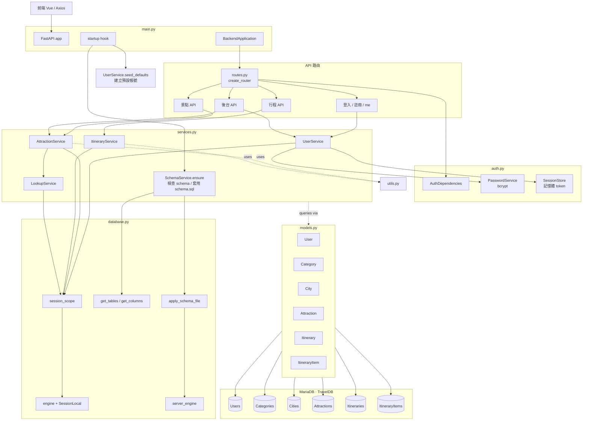
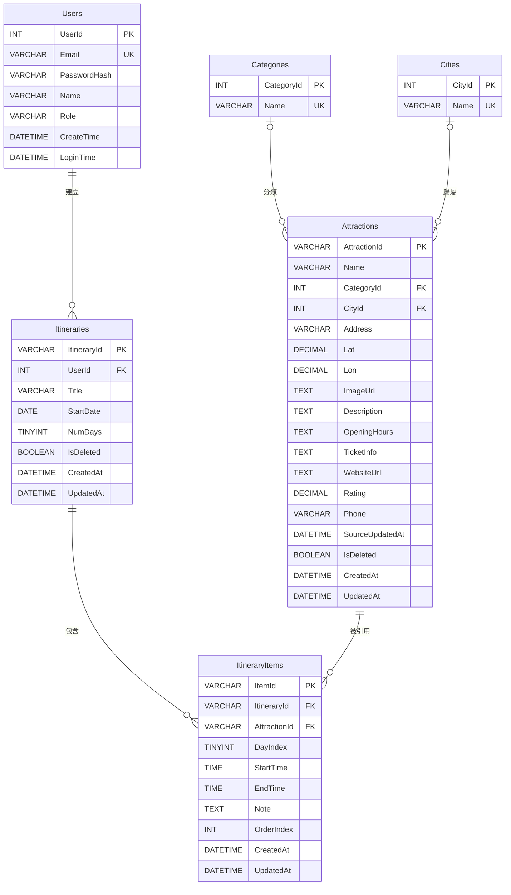

# 後端架構說明

本後端使用 **FastAPI + SQLAlchemy 2.0 ORM + MariaDB**。Python 程式採分層架構：`main.py` 組裝應用、`routes.py` 是 API 層、`services.py` 是業務邏輯、`models.py` 是 ORM 模型、`database.py` 提供連線與 session、`auth.py` 處理認證、`schemas.py` 是 request body 驗證、`utils.py` 放共用工具。

資料庫名稱：**TravelDB**。所有資料表與欄位皆採 **PascalCase**（無底線、首字母大寫）。

---

## 1. 檔案目錄

| 檔案 | 角色 | 主要功能 |
|---|---|---|
| `main.py` | 應用入口 | 組裝 `BackendApplication`、設定 CORS、註冊例外處理、掛載 routes、執行 startup 初始化。 |
| `routes.py` | API 路由層 | 定義所有 HTTP endpoint，接收 request 並呼叫 service，統一回傳 `{ "data": ... }`。 |
| `services.py` | 業務邏輯層 | `SchemaService` / `LookupService` / `UserService` / `AttractionService` / `ItineraryService`。 |
| `models.py` | ORM 模型層 | SQLAlchemy `DeclarativeBase` + 6 個 Mapped class，對應現有 6 張 PascalCase 表。 |
| `schemas.py` | Request models | Pydantic models，用於驗證前端傳入資料。 |
| `auth.py` | 認證與 session | bcrypt 密碼雜湊、記憶體 token session、FastAPI dependency。 |
| `database.py` | 資料庫工具層 | 建立 SQLAlchemy engine、`SessionLocal`、`session_scope()` context manager、schema 探測、執行 SQL 檔。 |
| `utils.py` | 共用工具 | 城市名稱正規化、地址解析、JSON 文字轉換、時間格式化。 |
| `schema.sql` | 資料庫 DDL | 建立 `TravelDB` 與 6 張 PascalCase 表；包含舊版遺留表的 `DROP IF EXISTS` 清理。 |
| `data_setting.sql` | 景點 seed 資料 | TRUNCATE 並重新匯入 `Categories` / `Cities` / `Attractions`。 |
| `attraction_dt.json` | 原始景點資料 | 僅供生成 `data_setting.sql` 參考，後端 Python 不直接讀取。 |

---

## 2. 啟動流程

```text
uvicorn main:app
```

`BackendApplication.__init__` 順序：

1. 建立 `FastAPI()` 物件。
2. 建立服務物件：`SchemaService` / `SessionStore` / `PasswordService` / `AuthDependencies` / `LookupService` / `UserService` / `AttractionService` / `ItineraryService`。
3. 設定 CORS（允許 `http://localhost:5173`、`http://localhost:3000`）。
4. 設定 HTTP exception handler，統一將錯誤包成 `{ "message": ... }`。
5. 透過 `create_router(...)` 掛載所有 API。
6. 註冊 startup event。

Startup 時依序執行：

| 步驟 | 動作 |
|---|---|
| 1 | `SchemaService.ensure()` — 用 SQLAlchemy `inspect` 檢查表/欄位是否符合預期；不符合就跑 `schema.sql` 重建。 |
| 2 | `UserService.seed_defaults()` — `Users` 為空時補上 `test@test.com` 與 `admin@test.com` 兩個帳號。 |

景點 seed (`data_setting.sql`) **不會被 Python 自動載入**，需手動執行。

---

## 3. 分層責任

### 3.1 `main.py`

只負責組裝，不寫 DB CRUD 也不放業務邏輯。

| 類別 | 功能 |
|---|---|
| `BackendApplication` | 建立 FastAPI app、初始化所有 service、設定 middleware/exception handler、定義 startup hook。 |

模組末端透過 `application = BackendApplication()` 與 `app = application.app` 對接 uvicorn。

### 3.2 `routes.py`

API 層；不直接寫 SQL、不處理密碼雜湊。

| 函式 | 功能 |
|---|---|
| `create_router(auth, users, attractions, itineraries)` | 組裝並回傳 `APIRouter`。 |

路由分組：

| 類型 | Endpoints |
|---|---|
| 認證 | `POST /login`、`POST /register` |
| 個人帳號 | `GET /me`、`PATCH /me`、`PUT /me/password`、`DELETE /me` |
| 景點 | `GET /attractions`、`GET /attractions/{id}`、`POST /attractions`、`PUT /attractions/{id}`、`DELETE /attractions/{id}` |
| 行程 | `GET /itineraries`、`GET /itineraries/trash`、`POST /itineraries`、`PATCH /itineraries/{id}`、`DELETE /itineraries/{id}`、`DELETE /itineraries/{id}/permanent`、`POST /itineraries/{id}/restore` |
| 行程項目 | `PUT /itineraries/{id}/items` |
| 後台 | `GET /admin/users`、`DELETE /admin/users/{user_id}` |

### 3.3 `services.py`

#### `SchemaService`

啟動時透過 `database.get_tables()` / `database.get_columns()` 比對 `information_schema`。檢查項目：

- 6 張必要表是否齊全（`Users` / `Categories` / `Cities` / `Attractions` / `Itineraries` / `ItineraryItems`）。
- `Users` 是否有 `Role` 欄位。
- `Attractions` 欄位集合是否等於白名單。
- `ItineraryItems` 是否有 `DayIndex`、`Itineraries` 是否不再有歷史 `IsAi`。
- 是否殘留舊表（`user_roles` / `towns` / `tags` / `attraction_tags` / `attraction_descriptions` / `user_favorites` / `user_visited`，全為 snake_case 留存）。

任一項不符 → 透過 `database.apply_schema_file('schema.sql')` 重建。

#### `LookupService`

支援 categories / cities 的「查無則建」邏輯，由 `AttractionService.create/update` 在同一 session 內呼叫。

| 方法 | 功能 |
|---|---|
| `category_id(session, name)` | 用 `mysql_insert(Category).prefix_with("IGNORE")` 寫入，再 `select` 取回 `CategoryId`。 |
| `city_id(session, name)` | 先 `norm_city()` 把「臺」轉「台」，再做相同流程拿 `CityId`。 |

#### `UserService`

| 方法 | 功能 |
|---|---|
| `seed_defaults()` | `Users` 為空時用 ORM `add_all` 補預設兩帳號。 |
| `login(email, password)` | `select(User)` 取資料、`PasswordService.verify`、`update(User)` 寫 `LoginTime=NOW()`、`SessionStore.create` 發 token。 |
| `register(body)` | Email 重複檢查 → `add(User)` → `flush()` 取得 `user_id` → 建 session。 |
| `update_profile(body, current_user, token)` | 動態組欄位 `update(User).values(...)`；變更 name / email 同步寫回記憶體 session。 |
| `change_password(body, current_user)` | 比對舊密碼後 `update(User)` 寫新雜湊。 |
| `delete_account(user_id)` | `delete(User)` + 移除該 user 所有 session。 |
| `list_users()` | `select(User.user_id, ...) order_by(UserId)` 後序列化 datetime 為 ISO 字串。 |
| `delete_user(user_id)` | 拒絕刪 admin、否則 `delete(User)`。 |

#### `AttractionService`

景點查詢全部在 SQL 端完成，**不維護任何 Python 端快取**。

| 方法 | 功能 |
|---|---|
| `list(q, cities, category, sort, page, page_size)` | 動態組 `select(Attraction, Category.Name, City.Name)` + `outerjoin`，依參數加 `where`、`order_by`、`limit/offset`。分頁時跑獨立 `COUNT(*) FROM subquery`。 |
| `get(attraction_id)` | 同樣 outerjoin Categories / Cities 撈一筆。 |
| `create(body)` | 從 location 抓 city fallback → `insert(Attraction).values(..., SourceUpdatedAt=func.now())` → 再 `get()` 回讀。 |
| `update(id, body)` | 確認存在 → `update(Attraction).values(..., SourceUpdatedAt=func.now())` → 再 `get()` 回讀。 |
| `delete(id)` | `update(...).values(IsDeleted=True)` 軟刪除。 |

排序鍵：

| sort | ORDER BY |
|---|---|
| `ns`（由北到南） | `Lat IS NULL, Lat DESC, AttractionId` |
| `sn`（由南到北） | `Lat IS NULL, Lat ASC, AttractionId` |
| `updated` | `SourceUpdatedAt IS NULL, SourceUpdatedAt DESC, AttractionId` |
| `rating` | `Rating IS NULL, Rating DESC, AttractionId` |
| 預設 | `AttractionId` |

#### `ItineraryService`

| 方法 | 功能 |
|---|---|
| `list_active(user_id)` | 撈使用者未刪行程，逐筆呼叫 `_load_items_for_itinerary` 撈 items（JOIN Attractions / Categories）。 |
| `list_trash(user_id)` | 撈使用者已刪行程。 |
| `create(body, user_id)` | `add(Itinerary)` 插入。 |
| `update(id, body, user_id)` | 擁有權檢查後動態 `update(Itinerary).values(...)`。 |
| `hard_delete` / `soft_delete` / `restore` | 永久刪除 / 軟刪除 / 還原。 |
| `replace_items(id, body, user_id)` | `delete(ItineraryItem)` 清空 → `session.execute(insert(ItineraryItem), payload)` 一次批次寫入。 |

所有 itinerary 操作都先 `_ensure_owned(session, itin_id, user_id)` 確認屬於目前登入者。

### 3.4 `models.py`

SQLAlchemy 2.0 Declarative，6 個 model：

| Class | `__tablename__` | 主要欄位（Python attr → DB column） |
|---|---|---|
| `User` | `Users` | `user_id`→`UserId`、`email`→`Email`、`password_hash`→`PasswordHash`、`name`→`Name`、`role`→`Role`、`create_time`→`CreateTime`、`login_time`→`LoginTime` |
| `Category` | `Categories` | `category_id`→`CategoryId`、`name`→`Name` |
| `City` | `Cities` | `city_id`→`CityId`、`name`→`Name` |
| `Attraction` | `Attractions` | `attraction_id`→`AttractionId`、`name`→`Name`、`category_id`→`CategoryId`、`city_id`→`CityId`、`address`→`Address`、`lat`→`Lat`、`lon`→`Lon`、`image_url`→`ImageUrl`、`description`→`Description`、`opening_hours`→`OpeningHours`、`ticket_info`→`TicketInfo`、`website_url`→`WebsiteUrl`、`rating`→`Rating`、`phone`→`Phone`、`source_updated_at`→`SourceUpdatedAt`、`is_deleted`→`IsDeleted`、`created_at`→`CreatedAt`、`updated_at`→`UpdatedAt` |
| `Itinerary` | `Itineraries` | `itinerary_id`→`ItineraryId`、`user_id`→`UserId`、`title`→`Title`、`start_date`→`StartDate`、`num_days`→`NumDays`、`is_deleted`→`IsDeleted`、`created_at`→`CreatedAt`、`updated_at`→`UpdatedAt` |
| `ItineraryItem` | `ItineraryItems` | `item_id`→`ItemId`、`itinerary_id`→`ItineraryId`、`attraction_id`→`AttractionId`、`day_index`→`DayIndex`、`start_time`→`StartTime`、`end_time`→`EndTime`、`note`→`Note`、`order_index`→`OrderIndex`、`created_at`→`CreatedAt`、`updated_at`→`UpdatedAt` |

Python attribute 維持 PEP 8 snake_case；DB 欄位走 PascalCase。每個 `mapped_column()` 的第一個位置引數即 DB 欄位名。

### 3.5 `schemas.py`

| Model | 用途 |
|---|---|
| `LoginBody` | 登入。 |
| `RegisterBody` | 註冊。 |
| `UpdateProfileBody` | 修改 name / email。 |
| `ChangePasswordBody` | 修改密碼。 |
| `CreateItineraryBody` | 建立行程。 |
| `UpdateItineraryBody` | 更新行程。 |
| `ItineraryItemInput` | 行程項目基本資料。 |
| `PutItemsBody` | 整批覆蓋行程項目。 |
| `AttractionBody` | 後台新增/修改景點。 |

### 3.6 `auth.py`

#### `PasswordService`
- `hash(password)`：bcrypt 雜湊。
- `verify(password, hashed)`：bcrypt 驗證。

#### `SessionStore`

純記憶體 dict（後端重啟所有 token 失效）。

- `create(user)`：發 UUID token。
- `get(token)`：取 user dict。
- `update_user(token, **fields)`：同步 profile 異動。
- `remove_user_sessions(user_id)`：刪 user 時清光該 user 的 token。

#### `AuthDependencies`
- `current_user`：必須登入，否則 401。
- `require_admin(current_user)`：role 必須是 admin。

### 3.7 `database.py`

| 物件 / 函式 | 功能 |
|---|---|
| `engine` | 綁定 `TravelDB` 的 SQLAlchemy engine。 |
| `server_engine` | 不指定 database 的 engine，給 schema bootstrap 用。 |
| `SessionLocal` | `sessionmaker` 工廠。 |
| `session_scope()` | context manager；成功 commit、失敗 rollback、結束 close。 |
| `get_tables()` | 回傳 DB 內所有表名（小寫化以兼容 Windows MariaDB `lower_case_table_names=1`）。 |
| `get_columns(table)` | 回傳該表欄位名集合（先試原名，失敗時用小寫再試）。 |
| `apply_schema_file(path)` | 讀 `.sql` 檔、用 `_split_sql_script` 切句、透過 `server_engine` 逐條 execute。 |
| `_split_sql_script(script)` | 簡易切句器：跳過空行與 `--` 註解，遇 `;` 即視為一句結束。 |

ORM 走 `session_scope()`，每個 service 方法各自開一份 session，做完就 commit/close。

### 3.8 `utils.py`

| 函式 / 常數 | 功能 |
|---|---|
| `CITY_NAMES` | 縣市名稱常數（給 `split_location` 比對用）。 |
| `norm_city(value)` | `"臺" → "台"` 正規化。 |
| `split_location(location)` | 從地址開頭推測縣市。 |
| `json_text(value)` | dict 轉 JSON 字串，str 原樣返回，None 保留。 |
| `fmt_time(value)` | 將 `time` / 字串 / `timedelta` 轉成 `HH:MM`。 |

---

## 4. 資料流範例

### 4.1 登入

```text
POST /login
  -> routes.login()
  -> UserService.login()
       session_scope():
         select(User) WHERE Email = ?      # 參數化 SQL
         PasswordService.verify(...)
         update(User) SET LoginTime = NOW() WHERE UserId = ?
       SessionStore.create({id, email, name, role})
  -> 回傳 { "data": { "token": "<uuid>" } }
```

### 4.2 景點列表（含過濾／排序／分頁）

```text
GET /attractions?q=湖&cities=台北市,新北市&sort=ns&page=1&page_size=10
  -> routes.list_attractions()
  -> AttractionService.list(...)
       session_scope():
         SELECT a.*, cat.Name, c.Name
         FROM Attractions a
           LEFT JOIN Categories cat ON a.CategoryId = cat.CategoryId
           LEFT JOIN Cities c       ON a.CityId     = c.CityId
         WHERE a.IsDeleted = FALSE
           AND (a.Name LIKE ? OR a.Address LIKE ?)
           AND c.Name IN (?, ?)
         ORDER BY a.Lat IS NULL, a.Lat DESC, a.AttractionId
         LIMIT 10 OFFSET 0
       同時跑 SELECT COUNT(*) FROM (...) 取得 total
  -> 回傳 { "data": { "items": [...], "total": N } }
```

### 4.3 新增景點

```text
POST /attractions  (Bearer admin token)
  -> routes.create_attraction()
  -> AuthDependencies.require_admin()
  -> AttractionService.create(body)
       session_scope():
         LookupService.category_id(session, body.category)
           # INSERT IGNORE INTO Categories (Name) VALUES (?)
           # SELECT CategoryId FROM Categories WHERE Name = ?
         LookupService.city_id(session, city_after_norm)
           # 同上，對 Cities
         INSERT INTO Attractions (...) VALUES (..., NOW())
       AttractionService.get(new_id)   # 開新 session 回讀
  -> 回傳新景點 dict
```

### 4.4 建立行程 + 批次覆蓋 items

```text
POST /itineraries           -> ItineraryService.create
PUT  /itineraries/{id}/items
  -> ItineraryService.replace_items()
       session_scope():
         _ensure_owned(session, itin_id, user_id)
         DELETE FROM ItineraryItems WHERE ItineraryId = ?
         INSERT INTO ItineraryItems (...) VALUES (...), (...), ...   # executemany
```

---

## 5. SQL 檔與資料匯入

### 5.1 `schema.sql`

- 建立 `TravelDB`、6 張 PascalCase 表。
- 開頭含 `DROP TABLE IF EXISTS`：當前 6 張表 PascalCase，歷史遺留表保留 snake_case 以兼容舊安裝。

### 5.2 `data_setting.sql`

匯入流程：

1. `USE TravelDB; SET NAMES utf8mb4;`
2. `SET FOREIGN_KEY_CHECKS = 0;` → `TRUNCATE` 4 張：`ItineraryItems` / `Attractions` / `Categories` / `Cities` → `SET FOREIGN_KEY_CHECKS = 1;`
3. `INSERT IGNORE INTO Categories (Name) VALUES ...`
4. `INSERT IGNORE INTO Cities (Name) VALUES ...`
5. 多筆 `INSERT INTO Attractions ... ON DUPLICATE KEY UPDATE ...` 寫入景點。

執行方式（Windows MariaDB CLI）：

```powershell
backend\mariadb-12.3.2-winx64\bin\mariadb.exe --ssl=0 --default-character-set=utf8mb4 -h localhost -P 3306 -u root -e "SOURCE C:/Users/Aya/Desktop/gittest/travel_web/backend/data_setting.sql;"
```

> 不要用 PowerShell 管線 `Get-Content ... | mariadb` 匯入，中文會變 `?`。

---

## 6. 維護原則

- 新增 API：放 `routes.py`，內部委派 service。
- 新增 request body：放 `schemas.py`。
- 新增業務邏輯：放對應的 `*Service`。
- 新增 ORM 對應：放 `models.py`；DB 欄位用 PascalCase、Python 屬性用 snake_case。
- 新增共用 helper：放 `utils.py`。
- 不要讓 `database.py` 反向 import service / route。
- 不要在 service 寫 raw SQL 字串（schema bootstrap 例外，由 `apply_schema_file` 集中處理）。
- 不要讓後端 Python 直接讀 `attraction_dt.json`。

---

## 7. 模組依賴方向

```text
main.py
  └── routes.py
        ├── schemas.py
        ├── auth.py
        └── services.py
              ├── models.py
              ├── database.py
              ├── auth.py
              ├── schemas.py
              └── utils.py
                            (database.py → MariaDB)
```

低層不可 import 高層；`database.py` 與 `models.py` 不知道 service 與 route 存在。

---

## 8. Prepared Statement / ORM 說明

- **ORM**：全面使用 SQLAlchemy 2.0。Service 層內所有 DB 操作都是 `select(...)` / `update(...)` / `delete(...)` / `insert(...)` 表達式，無手寫 SQL 字串（schema bootstrap 例外）。
- **Prepared Statement（語意層）**：所有使用者輸入透過 SQLAlchemy bind parameter 傳遞，杜絕 SQL injection。SQLAlchemy 的 compiled statement cache 也能避免重複 SQL 編譯成本。
- **Server-side `COM_STMT_PREPARE`**：目前底層 driver `pymysql` 仍走 client-side substitution。若要升級為真正的 server-side prepared statement，可把 engine URL 改為 `mysql+mysqlconnector` 並開 `connect_args={"prepared": True}`，service 層無需改動。

---

## 9. 模組架構圖



---

## 10. 資料庫關聯圖（烏鴉腳）



**關係與級聯行為**：

| 關係 | 基數 | FK 來源 | ON DELETE | ON UPDATE | 意義 |
|---|---|---|---|---|---|
| `Users (1) → Itineraries (0..N)` | 一對多 | `Itineraries.UserId` | CASCADE | CASCADE | 刪除使用者連同行程一併刪除。 |
| `Itineraries (1) → ItineraryItems (0..N)` | 一對多 | `ItineraryItems.ItineraryId` | CASCADE | CASCADE | 刪除行程連同 items 一併刪除。 |
| `Attractions (1) → ItineraryItems (0..N)` | 一對多 | `ItineraryItems.AttractionId` | RESTRICT | CASCADE | 景點被行程引用時禁止刪除，避免行程指向不存在的景點。 |
| `Categories (0..1) → Attractions (0..N)` | 弱一對多 | `Attractions.CategoryId`（可為 NULL） | SET NULL | CASCADE | 刪除分類時，相關景點 CategoryId 變 NULL，景點本體保留。 |
| `Cities (0..1) → Attractions (0..N)` | 弱一對多 | `Attractions.CityId`（可為 NULL） | SET NULL | CASCADE | 刪除城市時，相關景點 CityId 變 NULL，景點本體保留。 |

**索引**（schema.sql 內 `INDEX`）：

| 表 | Index | 欄位 |
|---|---|---|
| `Users` | `idx_users_role` | `Role` |
| `Categories` | `idx_categories_name` | `Name` |
| `Cities` | `idx_cities_name` | `Name` |
| `Attractions` | `idx_attractions_name` / `idx_attractions_category` / `idx_attractions_city` / `idx_attractions_rating` / `idx_attractions_updated` / `idx_attractions_deleted` | `Name` / `CategoryId` / `CityId` / `Rating` / `SourceUpdatedAt` / `IsDeleted` |
| `Itineraries` | `idx_itineraries_user_deleted_updated` | `(UserId, IsDeleted, UpdatedAt)` |
| `ItineraryItems` | `idx_itinerary_items_itinerary_day_order` | `(ItineraryId, DayIndex, OrderIndex)` |
