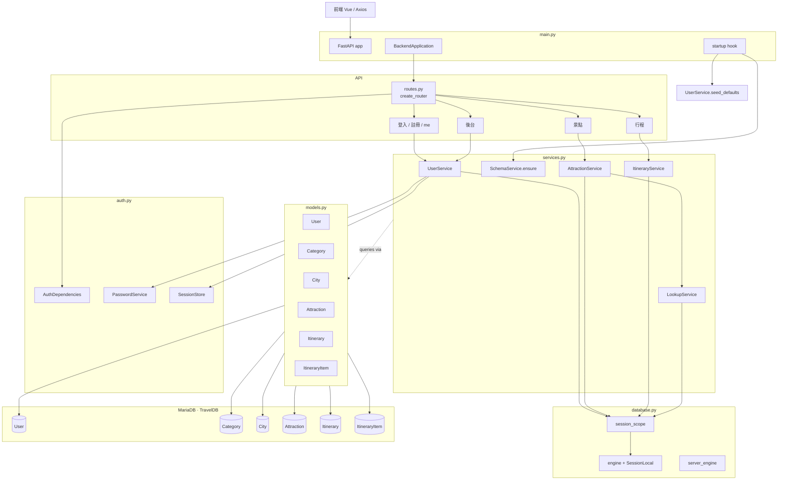

# 後端架構說明

**FastAPI + SQLAlchemy 2.0 + MariaDB**。資料庫 `TravelDB`。表名走 **UpperCamelCase 單數**（`User`、`Itinerary`…），欄位走 **snake_case**。

---

## 1. 檔案

| 檔案 | 角色 |
|---|---|
| `main.py` | 組裝 `BackendApplication`、CORS、exception handler、startup hook。 |
| `routes.py` | API 層，全部委派給 service。 |
| `services.py` | `SchemaService` / `LookupService` / `UserService` / `AttractionService` / `ItineraryService`。 |
| `models.py` | SQLAlchemy 2.0 Declarative，6 個 model。 |
| `schemas.py` | Pydantic request bodies。 |
| `auth.py` | `PasswordService`（bcrypt）、`SessionStore`（記憶體 token）、`AuthDependencies`。 |
| `database.py` | engine、`session_scope()`、`get_tables` / `get_columns`、`apply_schema_file`。 |
| `utils.py` | 城市正規化、地址解析、JSON / 時間轉換。 |
| `schema.sql` | DDL；含舊表 `DROP IF EXISTS` 清理。 |
| `data_setting.sql` | 景點 seed；需手動執行。 |
| `attraction_dt.json` | seed 原始資料，Python 不直接讀。 |

---

## 2. 啟動

```text
uvicorn main:app
```

`BackendApplication.__init__` 建 FastAPI、初始化 service、設 CORS（`localhost:5173` / `localhost:3000`）、統一錯誤格式 `{ "message": ... }`、掛 routes、註冊 startup。

Startup：

1. `SchemaService.ensure()` — 用 `inspect` 比對表/欄位；不符跑 `schema.sql`。
2. `UserService.seed_defaults()` — `User` 為空時補 `test@test.com` / `admin@test.com`。

景點 seed 不會自動載入。

---

## 3. Endpoints

| 類型 | Endpoints |
|---|---|
| 認證 | `POST /login`、`POST /register` |
| 帳號 | `GET /me`、`PATCH /me`、`PUT /me/password`、`DELETE /me` |
| 景點 | `GET /attractions`、`GET /attractions/{id}`、`POST /attractions`、`PUT /attractions/{id}`、`DELETE /attractions/{id}` |
| 行程 | `GET /itineraries`、`GET /itineraries/trash`、`POST /itineraries`、`PATCH /itineraries/{id}`、`DELETE /itineraries/{id}`、`DELETE /itineraries/{id}/permanent`、`POST /itineraries/{id}/restore` |
| 行程項目 | `PUT /itineraries/{id}/items` |
| 後台 | `GET /admin/users`、`DELETE /admin/users/{user_id}` |

回傳統一包成 `{ "data": ... }`；錯誤統一 `{ "message": ... }`。

---

## 4. 分層責任

### `SchemaService`

啟動時檢查：6 張必要表存在、`User.role` 欄位存在、`Attraction` 欄位集合等於白名單、`ItineraryItem.day_index` 存在、`Itinerary` 沒有歷史 `is_ai`、無舊表殘留（`users`、`categories`… 等複數表、`tags` 等）。任一不符 → `apply_schema_file('schema.sql')`。

### `LookupService`

`category_id` / `city_id`：`INSERT IGNORE` 再 `SELECT` 拿 id；`city_id` 先 `norm_city()`（「臺」→「台」）。

### `UserService`

| 方法 | 功能 |
|---|---|
| `seed_defaults` | 表空時補預設兩帳號。 |
| `login` | `SELECT` → 驗密碼 → 寫 `login_time` → `SessionStore.create` 發 token。 |
| `register` | Email 重複檢查 → `add` → `flush` 拿 id → 發 token。 |
| `update_profile` | 動態組欄位 `update(User).values(...)`，同步記憶體 session。 |
| `change_password` | 比對舊密碼後寫新雜湊。 |
| `delete_account` | `delete(User)` + 清該 user 全部 token。 |
| `list_users` / `delete_user` | 後台用；`delete_user` 拒刪 admin。 |

### `AttractionService`

景點查詢全部在 SQL 端（不維護 Python 快取）。

| 方法 | 功能 |
|---|---|
| `list` | 動態組 `select(Attraction, Category.name, City.name) + outerjoin`，加 where / order_by / limit / offset；分頁時跑獨立 `COUNT`。 |
| `get` | outerjoin 撈一筆。 |
| `create` / `update` | 共用 `_build_attraction_values` 組欄位字典，經 `LookupService` 轉 id → `insert/update`，`source_updated_at=NOW()`，再 `get()` 回讀。 |
| `delete` | `is_deleted=True` 軟刪除。 |

排序鍵 `sort`：

| key | ORDER BY |
|---|---|
| `ns` / `sn` | `lat IS NULL, lat DESC/ASC, attraction_id` |
| `updated` | `source_updated_at IS NULL, source_updated_at DESC, attraction_id` |
| `rating` | `rating IS NULL, rating DESC, attraction_id` |
| 預設 | `attraction_id` |

### `ItineraryService`

| 方法 | 功能 |
|---|---|
| `list_active` / `list_trash` | 撈使用者行程；共用 `_itinerary_summary` 組回傳 dict，active 帶 `with_items=True` 觸發 `_load_items_for_itinerary`（JOIN Attraction / Category），trash 帶 `False` 不撈 items。 |
| `create` / `update` | `add` / 動態 `update`。 |
| `soft_delete` / `restore` / `hard_delete` | 軟刪 / 還原 / 永久刪除。 |
| `replace_items` | `DELETE` 全清 → `executemany` 批次 `INSERT`。 |

所有寫入前先 `_ensure_owned(session, itin_id, user_id)`。

### `auth.py`

- **PasswordService**：bcrypt `hash` / `verify`。
- **SessionStore**：純記憶體 dict，UUID token；`create` / `get` / `update_user` / `remove_user_sessions`。後端重啟全失效。
- **AuthDependencies**：`current_user`（必登入）、`require_admin`。

### `database.py`

| 物件 | 功能 |
|---|---|
| `engine` | 綁 `TravelDB` 的 engine。 |
| `server_engine` | 不指定 DB，給 schema bootstrap 用。 |
| `SessionLocal` | sessionmaker 工廠。 |
| `session_scope()` | context manager；成功 commit、失敗 rollback。 |
| `get_tables` / `get_columns` | 透過 `inspect` 讀 `information_schema`；表名小寫化兼容 Windows MariaDB。 |
| `apply_schema_file(path)` | 切句後逐條 execute。 |

### `utils.py`

`CITY_NAMES`、`norm_city`（臺→台）、`split_location`（地址抓縣市）、`json_text`（dict→JSON 字串）、`fmt_time`（轉 `HH:MM`）。

---

## 5. 資料模型

`models.py` 6 個 Declarative class，Python 屬性名與 DB 欄位名相同（snake_case）：

| Class | `__tablename__` | 主要欄位 |
|---|---|---|
| `User` | `User` | `user_id`、`email`、`password_hash`、`name`、`role`、`create_time`、`login_time` |
| `Category` | `Category` | `category_id`、`name` |
| `City` | `City` | `city_id`、`name` |
| `Attraction` | `Attraction` | `attraction_id`(PK varchar)、`name`、`category_id`、`city_id`、`address`、`lat`、`lon`、`image_url`、`description`、`opening_hours`、`ticket_info`、`website_url`、`rating`、`phone`、`source_updated_at`、`is_deleted`、`created_at`、`updated_at` |
| `Itinerary` | `Itinerary` | `itinerary_id`(PK uuid)、`user_id`、`title`、`start_date`、`num_days`、`is_deleted`、`created_at`、`updated_at` |
| `ItineraryItem` | `ItineraryItem` | `itinerary_item_id`(PK uuid)、`itinerary_id`、`attraction_id`、`day_index`、`start_time`、`end_time`、`note`、`order_index`、`created_at`、`updated_at` |

---

## 6. SQL 檔

**schema.sql**：建 `TravelDB` 與 6 張表；開頭 `DROP IF EXISTS` 含歷史遺留複數 PascalCase 表（`Users`、`Attractions`…）跟舊 snake_case 表。

**data_setting.sql**：`USE TravelDB; SET NAMES utf8mb4;` → 關 FK → `TRUNCATE` 4 張（`ItineraryItem` / `Attraction` / `Category` / `City`）→ 開 FK → `INSERT IGNORE` Category / City → `INSERT ... ON DUPLICATE KEY UPDATE` 景點。

匯入（Windows MariaDB CLI）：

```powershell
backend\mariadb-12.3.2-winx64\bin\mariadb.exe --ssl=0 --default-character-set=utf8mb4 -h localhost -P 3306 -u root -e "SOURCE C:/Users/Aya/Desktop/nor/travel_web/backend/data_setting.sql;"
```

> 不要用 `Get-Content ... | mariadb`，中文會變 `?`。

---

## 7. 維護原則

- 新增 API → `routes.py` 委派 service。
- 新增 body → `schemas.py`。
- 新增業務邏輯 → 對應 `*Service`。
- 新增 ORM → `models.py`（表單數 UpperCamelCase、欄位 snake_case）。
- 新增 helper → `utils.py`。
- 不在 service 寫 raw SQL（schema bootstrap 例外）。
- 低層不可 import 高層。

---

## 8. ORM / SQL 注入防護

ORM 全面用 SQLAlchemy 2.0 expression。所有使用者輸入透過 bind parameter，杜絕 SQL injection。底層 driver `pymysql` 是 client-side substitution；若要 server-side prepared statement 可換 `mysql+mysqlconnector` 並 `connect_args={"prepared": True}`，service 無需改動。

---

## 9. 模組依賴

```text
main.py
  └── routes.py
        ├── schemas.py
        ├── auth.py
        └── services.py
              ├── models.py
              ├── database.py
              ├── auth.py
              ├── schemas.py
              └── utils.py
                            (database.py → MariaDB)
```



---

## 10. 資料庫關聯（烏鴉腳）

